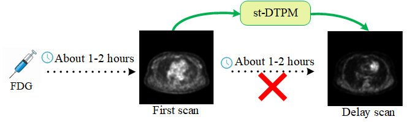
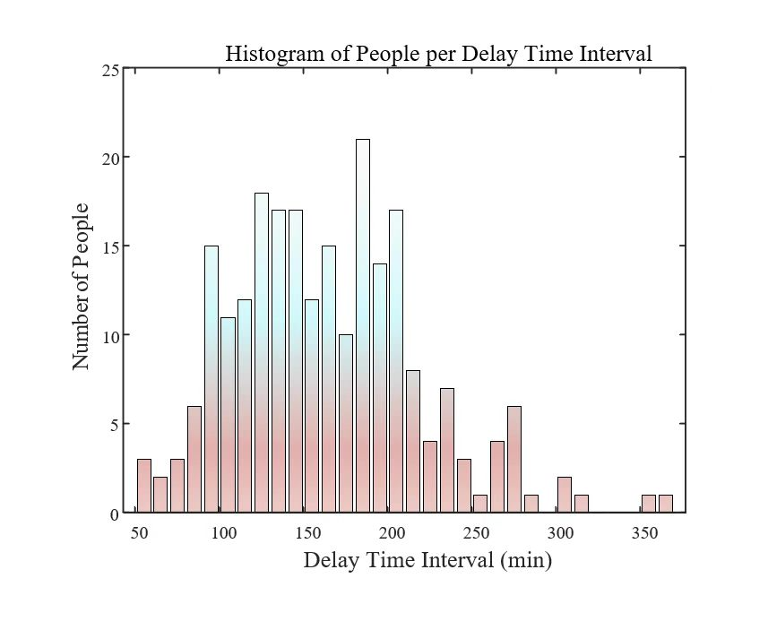
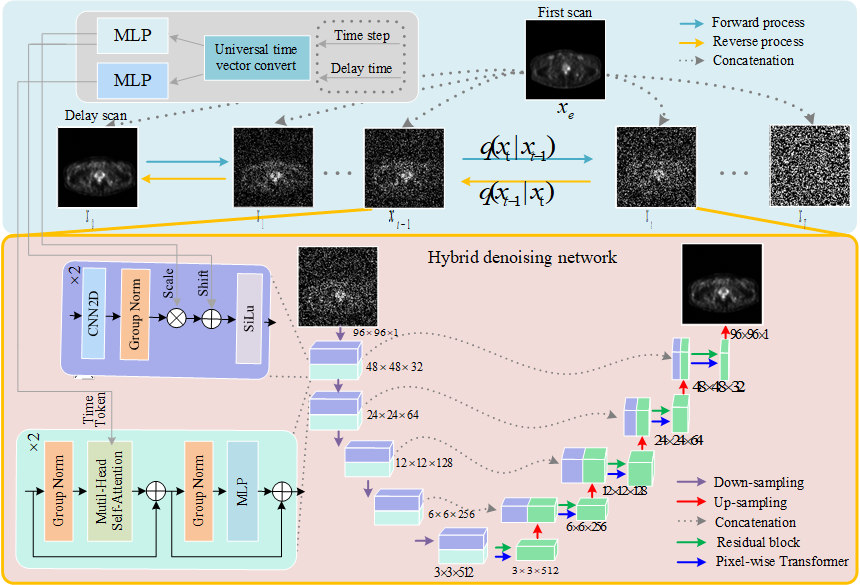
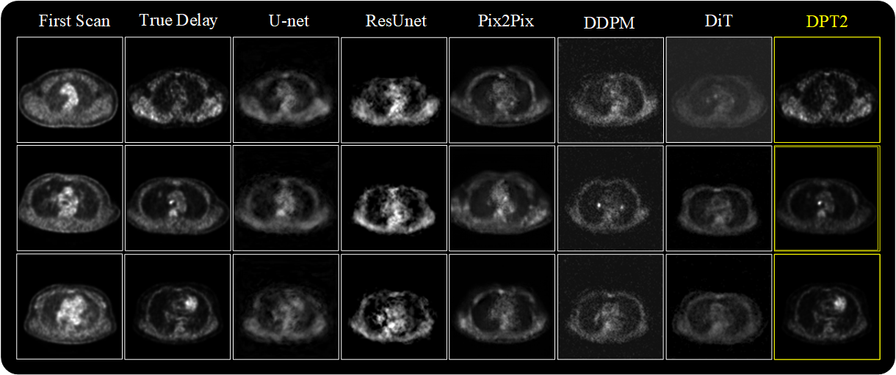

# st-DTPM

**paper**:  [st-DTPM: Spatial-Temporal Guided Diffusion Transformer Probabilistic Model for Delayed Scan PET Image Prediction](https://arxiv.org/abs/2410.22732)

**Authors**: Ran Hong, Yuxia Huang, Lei Liu, Mengxiao Geng, Zhonghui Wu, Bingxuan Li, Xuemei Wang, Qiegen Liu*

**Date**: Apr. 28, 2025

The code and the algorithm are for non-commercial use only.

Copyright 2025, School of Information Engineering, Nanchang University.

----

### Intro

The target of delayed scan PET image prediction is to predict delayed scan PET image from first scan PET image.

----

### Motivation

The time interval between first and delayed PET image is a crucial factor affecting delayed imaging. And in clinical practice, the time interval for each patient to perform delayed imaging is uncertain.

----

### Proposed

A **Diffusion** model with **Transformer** under **Spatial-Temporal** guidance is proposed. Spatial condition is first scan PET image; Temporal condition is delay time interval.

----

### Results 

----

### Related work

- [Denoising Diffusion Probabilistic Models](https://arxiv.org/abs/2006.11239)

- [Improved Denoising Diffusion Probabilistic Models](https://arxiv.org/abs/2102.09672)

- [Image Super-Resolution via Iterative Refinement](https://arxiv.org/abs/2104.07636)

